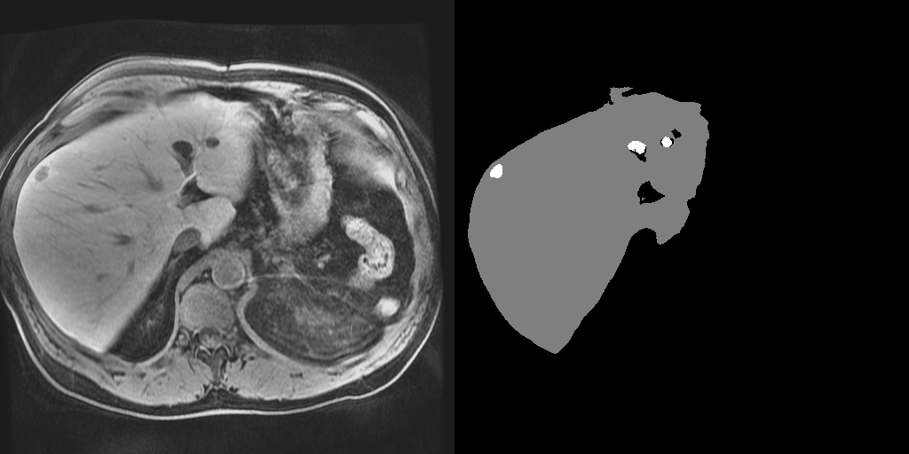
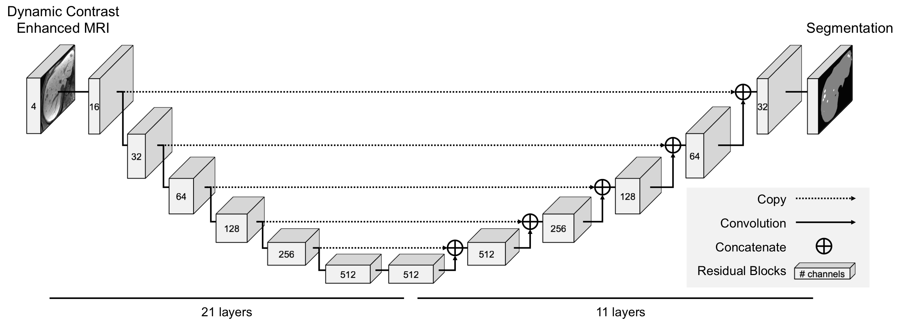

# Liver Lesion Detection Network

TensorFlow implementation of the 3D lesion detection network. This repository provides code that uses pretrained models to perform inference on 4-channel Dynamic Contrast Eovist MRI (pre-contrast, 30 seconds, 70 seconds and 20 minutes post contrast) of the abdomen.



## Framework
The pipeline consists of two consecutive stages of the same 3D neural network. During the first stage, the network detects the liver within the 3D abdominal MRI volume (i.e., liver detector) based on a resampled image to (4mm)<sup>3</sup>. In the second stage a cuboid that contains the liver predicted in the first stage is used as the input at the original resolution (i.e., lesion detector). The resulting output is a segmentation image indicating whether each volume element belongs to the background, the liver, or the lesion.



## Prerequisites
- Linux (Ubuntu 18.04+ preferred)
- Python 3.6+

## Getting started
1. Clone this repository.
    ```bash
    git clone https://github.com/stmharry/liver-lesion-detection.git && cd liver-lesion-detection
    ```

2. Download models and example images.
    ```bash
    curl https://liver-lesion-detection.s3.amazonaws.com/assets.tar | tar -x -C .
    ```

3. Install `pip` required packages. (or use virtual environment)
    ```bash
    pip install -r requirements.txt
    ```

4. Run the model and collect outputs at `./results`.
    ```bash
    python main.py 
    ```

Below is the synopsis of `main.py`. You can change the flags to point to your own image directory. E.g., `python main.py --test_dir /path/to/my_test_images`.
```
main.py:
--output_dir: Root directory to write outputs.
    (default: './results')
--test_dir: Directory containing nifti files for testing.
    (default: './images')
```

This repository currently only contains the necessary code for inference (testing). Training is not included but interested parties are welcomed to contact `stmharry@mit.edu`for more information.
